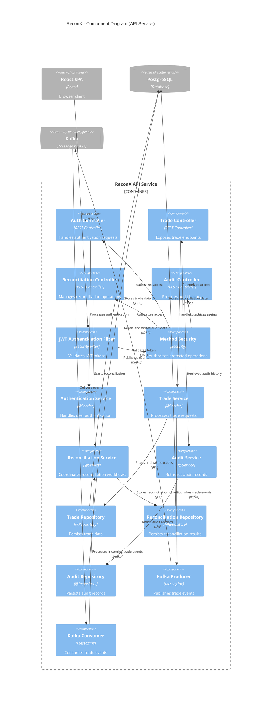

# ReconX – C4 Level 3 (Component)

```mermaid
C4Component
title ReconX - Component Diagram (API Service)

Container_Ext(ui, "React SPA", "React", "Browser client")
ContainerDb_Ext(db, "PostgreSQL", "Database")
ContainerQueue_Ext(kafka, "Kafka", "Message broker")

Container_Boundary(api, "ReconX API Service") {

    Component(authController, "Auth Controller", "REST Controller", "Handles authentication requests")
    Component(tradeController, "Trade Controller", "REST Controller", "Exposes trade endpoints")
    Component(reconController, "Reconciliation Controller", "REST Controller", "Manages reconciliation operations")
    Component(auditController, "Audit Controller", "REST Controller", "Provides audit history")

    Component(jwtFilter, "JWT Authentication Filter", "Security Filter", "Validates JWT tokens")
    Component(methodSecurity, "Method Security", "Security", "Authorizes protected operations")

    Component(authService, "Authentication Service", "@Service", "Handles user authentication")
    Component(tradeService, "Trade Service", "@Service", "Processes trade requests")
    Component(reconService, "Reconciliation Service", "@Service", "Coordinates reconciliation workflows")
    Component(auditService, "Audit Service", "@Service", "Retrieves audit records")

    Component(tradeRepository, "Trade Repository", "@Repository", "Persists trade data")
    Component(reconRepository, "Reconciliation Repository", "@Repository", "Persists reconciliation results")
    Component(auditRepository, "Audit Repository", "@Repository", "Persists audit records")

    Component(kafkaProducer, "Kafka Producer", "Messaging", "Publishes trade events")
    Component(kafkaConsumer, "Kafka Consumer", "Messaging", "Consumes trade events")
}

Rel(ui, jwtFilter, "API requests", "HTTPS")
Rel(jwtFilter, methodSecurity, "Validates token", "JWT")
Rel(methodSecurity, authController, "Authorizes access")
Rel(methodSecurity, tradeController, "Authorizes access")
Rel(methodSecurity, reconController, "Authorizes access")
Rel(methodSecurity, auditController, "Authorizes access")

Rel(authController, authService, "Processes authentication")
Rel(tradeController, tradeService, "Handles trade requests")
Rel(reconController, reconService, "Starts reconciliation")
Rel(auditController, auditService, "Retrieves audit history")

Rel(tradeService, tradeRepository, "Reads and writes trades", "JPA")
Rel(reconService, reconRepository, "Stores reconciliation results", "JPA")
Rel(auditService, auditRepository, "Reads audit records", "JPA")

Rel(tradeService, kafkaProducer, "Publishes trade events", "Kafka")
Rel(kafkaConsumer, reconService, "Processes incoming trade events", "Kafka")

Rel(tradeRepository, db, "Stores trade data", "JDBC")
Rel(reconRepository, db, "Stores reconciliation data", "JDBC")
Rel(auditRepository, db, "Reads and writes audit data", "JDBC")

Rel(kafkaProducer, kafka, "Publishes events", "Kafka")
Rel(kafka, kafkaConsumer, "Delivers events", "Kafka")
```