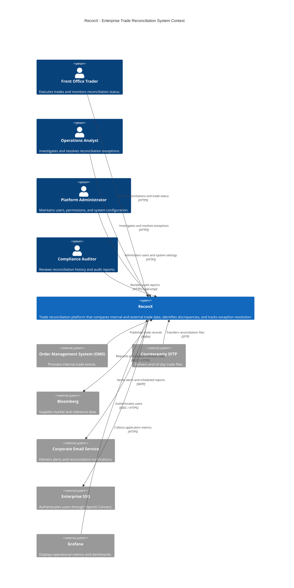

# ReconX – C4 Level 1 (System Context)

```mermaid
C4Context
title ReconX - Enterprise Trade Reconciliation System Context

Person(trader, "Front Office Trader", "Executes trades and monitors reconciliation status.")
Person(operations, "Operations Analyst", "Investigates and resolves reconciliation exceptions.")
Person(administrator, "Platform Administrator", "Maintains users, permissions, and system configuration.")
Person(auditor, "Compliance Auditor", "Reviews reconciliation history and audit reports.")

System(reconx, "ReconX", "Trade reconciliation platform that compares internal and external trade data, identifies discrepancies, and tracks exception resolution.")

System_Ext(oms, "Order Management System (OMS)", "Provides internal trade events.")
System_Ext(sftp, "Counterparty SFTP", "Delivers end-of-day trade files.")
System_Ext(bloomberg, "Bloomberg", "Supplies market and reference data.")
System_Ext(email, "Corporate Email Service", "Delivers alerts and reconciliation notifications.")
System_Ext(sso, "Enterprise SSO", "Authenticates users through OpenID Connect.")
System_Ext(grafana, "Grafana", "Displays operational metrics and dashboards.")

Rel(trader, reconx, "Views reconciliations and trade status", "HTTPS")
Rel(operations, reconx, "Investigates and resolves exceptions", "HTTPS")
Rel(administrator, reconx, "Administers users and system settings", "HTTPS")
Rel(auditor, reconx, "Reviews audit reports", "HTTPS (read-only)")

Rel(oms, reconx, "Publishes trade records", "Kafka")
Rel(sftp, reconx, "Transfers reconciliation files", "SFTP")
Rel(reconx, bloomberg, "Requests pricing and reference data", "REST / HTTPS")
Rel(reconx, email, "Sends alerts and scheduled reports", "SMTP")
Rel(reconx, sso, "Authenticates users", "OIDC / HTTPS")
Rel(grafana, reconx, "Collects application metrics", "HTTPS")
```